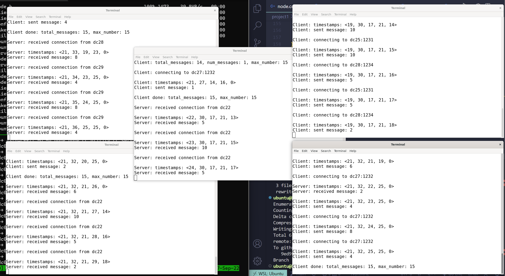

# CS6378 Advanced OS
Contains the programming assignments for the advanced os class.

| Student Name | NetID |
| :---: | :---: |
| Kushan Singh | kxs200085 |
| Akshay Jain | axj190052 |

# Steps to compile

1. Make all shell scripts executable.
    ```bash
    $ chmod +x *.sh
    ```
2. Move the shell scripts outside the `project1` directory. 
    ```bash
    $ mv *.sh ../
    ```
3. Copy `project1` from your local system to the home directory on the `dcXX.utdallas.edu` nodes.
    ```bash
    $ ./copy_to.sh
    ```
4. Log into any one node on `dcXX.utdallas.edu` and compile the program.
    ```bash
    $ ssh -l <netid>@dcXX.utdallas.edu
    {dxXX:~} cd project1/ && make node
    ```
5. Launch the program from your local system.
    ```bash
    $ ./launcher.sh
    ```
6. Clean up the processes with the cleanup script. 
    ```bash
    $ ./cleanup.sh
    ```

# Sample Output

